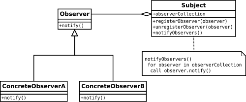

Observer Pattern
=====================
### Illustration




### The Basic
Below is a simple examples for Observer Pattern

#####html
```html
<input id="myBtn" type="button" value="click"></input>
```

#####javascript
```javascript
//the subject
var subject = document.querySelector("#myBtn");

//create observers
var Observer = function(name) {
	this.name = name;
}

Observer.prototype.notify = function() {
	console.log(this.name + " receives notification");
}

var obj1 = new Observer("obj1");
var obj2 = new Observer("obj2");

//observe
subject.addEventListener("click", obj1.notify.bind(obj1));
subject.addEventListener("click", obj2.notify.bind(obj2));
```

### Self defined event
